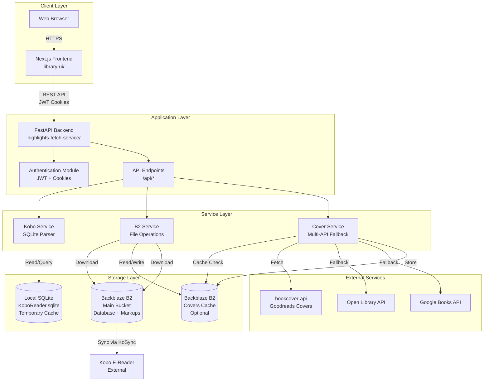
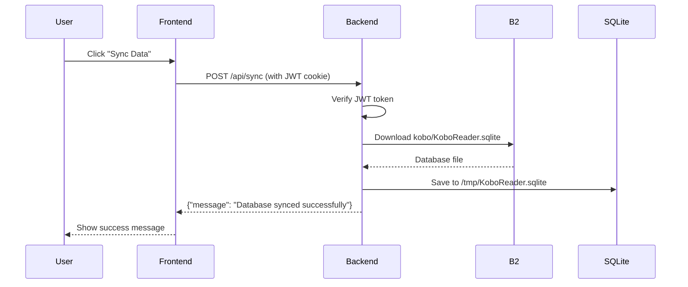
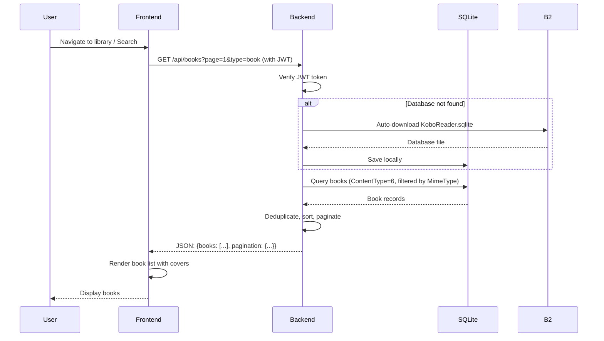
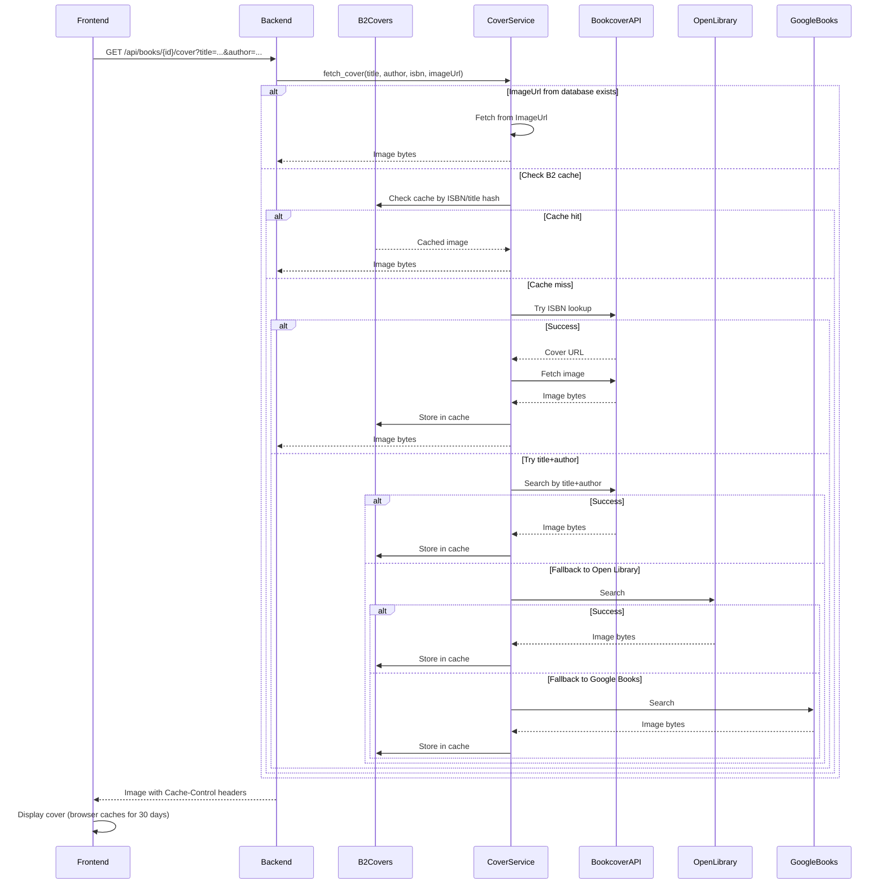
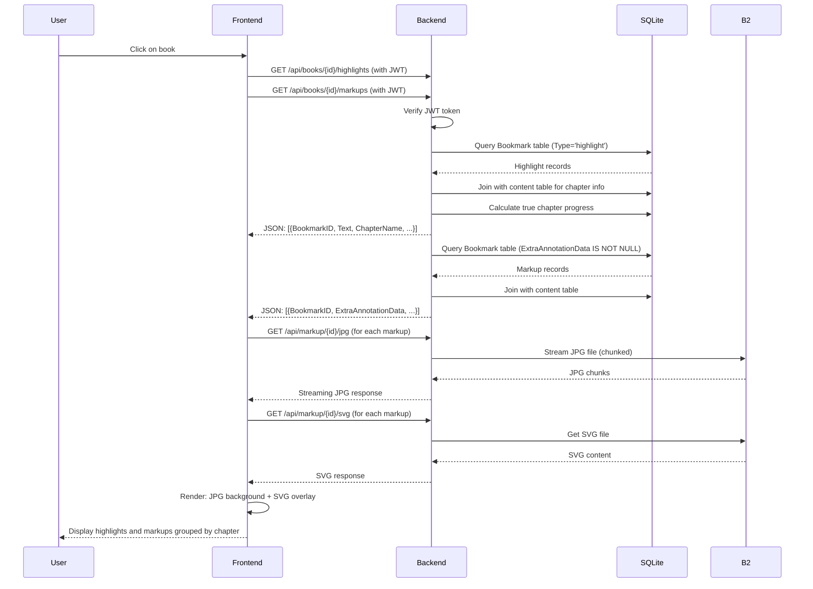

# Readr - High-Level Architecture Document

## 1. Project Overview

### What the Project Does

**Readr** is a personal reading insights platform that syncs, organizes, and helps users rediscover highlights and annotations from their Kobo e-reader. Unlike traditional e-book readers, Readr focuses on extracting and presenting the intellectual value from reading sessions—highlights, annotations, and markups (handwritten notes/drawings)—in a searchable, organized web interface.

### Core Problem It Solves

- **Data Access**: Kobo reading data is stored in a local SQLite database (`KoboReader.sqlite`) that's difficult to access and browse on desktop/web
- **Data Organization**: Highlights and annotations are buried in a complex database structure without intuitive organization
- **Cross-Device Access**: Reading insights are locked on the device; users want web-based access to their reading journey
- **Content Discovery**: Users struggle to rediscover and connect insights across multiple books and articles

### Who This System Is For

- **Primary Users**: Personal users who own Kobo e-readers and want web-based access to their reading highlights
- **Use Case**: Single-user personal library (authentication supports one user account)
- **Data Source**: Users who sync their `KoboReader.sqlite` to Backblaze B2 (via tools like KoSync)

---

## 2. High-Level Architecture

### Major System Components

The system follows a **client-server architecture** with clear separation between:

1. **Frontend (Next.js)**: React-based web application for browsing and organizing highlights
2. **Backend (FastAPI)**: RESTful API service for data synchronization, parsing, and retrieval
3. **Storage Layer**:
   - Backblaze B2 (cloud storage for database and markups)
   - Local SQLite (temporary database cache)
   - B2 Covers Cache (optional separate bucket for cover images)
4. **External Dependencies**:
   - Book cover APIs (bookcover-api, Open Library, Google Books)
   - Authentication (JWT-based, single-user)

### Component Boundaries

- **Frontend ↔ Backend**: REST API with JWT authentication (httpOnly cookies)
- **Backend ↔ B2**: B2 SDK for file operations (read database, read/write covers, read markups)
- **Backend ↔ SQLite**: Direct SQLite queries for parsing Kobo database
- **Backend ↔ Cover APIs**: HTTP requests to external book cover services
- **Frontend ↔ Backend Auth**: Cookie-based session management with middleware protection

### Architecture Diagram

---

## 3. Component Breakdown

### 3.1 Frontend (`library-ui/`)

**Purpose**: Provide a modern, responsive web interface for browsing books, articles, highlights, and markups.

**Key Modules**:

- `app/page.tsx`: Main library view with tabs for books/articles, search, pagination
- `app/books/[id]/page.tsx`: Book detail page showing highlights and markups grouped by chapter
- `app/login/page.tsx`: Authentication login form
- `components/BookList.tsx`: Paginated book/article list with filtering
- `components/BookCover.tsx`: Cover image component with fallback handling
- `components/ScribbleRenderer.tsx`: Markup rendering (SVG overlay on JPG)
- `lib/api.ts`: API client functions (fetch wrappers)
- `lib/auth.ts`: Authentication utilities
- `middleware.ts`: Next.js middleware for route protection

**Inputs**:

- User interactions (search, pagination, navigation)
- API responses (books, highlights, markups, covers)

**Outputs**:

- Rendered UI (book lists, highlight cards, markup images)
- API requests (authenticated via cookies)

**Design Intent**:

- **Client-side rendering** for fast interactions
- **Server-side authentication** via middleware for security
- **Progressive loading** for markups (JPG background + SVG overlay)
- **Responsive design** with Tailwind CSS and shadcn/ui components

---

### 3.2 Backend API (`highlights-fetch-service/app/api/`)

**Purpose**: Expose RESTful endpoints for data synchronization, retrieval, and cover fetching.

**Key Modules**:

- `endpoints.py`: Main API routes (`/sync`, `/books`, `/books/{id}/highlights`, `/books/{id}/markups`, `/books/{id}/cover`)
- `auth.py`: Authentication endpoints (`/login`, `/logout`, `/verify`, `/me`)

**Inputs**:

- HTTP requests (GET, POST)
- JWT tokens (cookies or Authorization header)
- Query parameters (pagination, search, content type filters)

**Outputs**:

- JSON responses (books, highlights, markups)
- Binary responses (cover images, markup SVGs/JPGs)
- HTTP status codes and error messages

**Design Intent**:

- **RESTful design** with clear resource-based URLs
- **Authentication-first** approach (all endpoints protected except `/auth/verify`)
- **Auto-sync** capability (downloads database if missing on first request)
- **Content-type filtering** (books vs articles via MimeType)

---

### 3.3 Kobo Service (`highlights-fetch-service/app/services/kobo.py`)

**Purpose**: Parse and query the Kobo SQLite database to extract books, highlights, and markups.

**Key Modules**:

- `KoboService`: Main service class with database connection management
- Query methods: `get_books()`, `get_highlights()`, `get_markups()`, `get_book_by_id()`

**Inputs**:

- SQLite database file path
- Query parameters (limit, offset, search, content_type)

**Outputs**:

- Structured dictionaries (books with metadata, highlights with chapter info, markups with location data)

**Design Intent**:

- **Direct SQLite access** (no ORM overhead for performance)
- **Bytes handling** (Kobo stores text as bytes; service decodes appropriately)
- **Deduplication logic** (handles duplicate book entries by picking highest progress)
- **Chapter progress calculation** (converts section-relative progress to chapter-wide progress)
- **Content type classification** (books vs articles via MimeType patterns)

**Key Queries**:

- Books: `ContentType = '6'` AND `BookID IS NULL` (top-level items)
- Highlights: `Bookmark.Type = 'highlight'` joined with `content` table
- Markups: `Bookmark.ExtraAnnotationData IS NOT NULL` (contains scribble data)

---

### 3.4 B2 Service (`highlights-fetch-service/app/services/b2.py`)

**Purpose**: Interface with Backblaze B2 for file operations (download database, retrieve markups, cache covers).

**Key Modules**:

- `B2Service`: Generic B2 service class (supports multiple buckets)
- Two instances: `b2_service` (main bucket) and `b2_covers_service` (optional covers bucket)

**Inputs**:

- B2 credentials (Application Key ID, Application Key, Bucket Name)
- File paths/names

**Outputs**:

- File downloads (to local path or memory)
- File uploads (covers to cache)
- File streams (for large markup JPGs)

**Design Intent**:

- **Separation of concerns** (main bucket for data, optional covers bucket for caching)
- **Streaming support** (chunked downloads for large files to reduce memory usage)
- **Connection management** (lazy connection with retry logic)
- **Error handling** (graceful fallbacks if bucket unavailable)

---

### 3.5 Cover Service (`highlights-fetch-service/app/services/cover_service.py`)

**Purpose**: Fetch book covers from multiple sources with intelligent fallback and B2 caching.

**Key Modules**:

- `CoverService`: Main service with caching integration
- Static methods: `fetch_from_bookcover_api()`, `fetch_from_open_library()`, `fetch_from_google_books()`

**Inputs**:

- Book metadata (title, author, ISBN, ImageUrl from database)

**Outputs**:

- Image bytes with content type
- Cache keys for B2 storage

**Design Intent**:

- **Priority-based fallback**:
  1. B2 cache (instant)
  2. ImageUrl from Kobo database (for articles/embedded covers)
  3. bookcover-api (Goodreads, highest quality)
  4. Open Library (fallback)
  5. Google Books (final fallback)
- **Smart caching** (cache keys based on ISBN > ImageUrl hash > title+author hash)
- **Title simplification** (removes special characters for better API matching)

---

### 3.6 Authentication (`highlights-fetch-service/app/core/auth.py`)

**Purpose**: Provide JWT-based authentication for single-user access control.

**Key Modules**:

- `authenticate_user()`: Password verification (plaintext comparison for single-user)
- `create_access_token()`: JWT generation with configurable expiry
- `require_auth()`: FastAPI dependency for route protection
- `get_current_user_from_cookie()`: Cookie-based token extraction

**Inputs**:

- Username and password (from login request)
- JWT tokens (from cookies or Authorization header)

**Outputs**:

- JWT tokens (with httpOnly cookies for browsers)
- User identity (username from token payload)

**Design Intent**:

- **Single-user mode** (simple password comparison, no database)
- **Dual authentication** (cookies for browsers, Bearer tokens for API clients)
- **Configurable expiry** (default 7 days, max 30 days)
- **Security validation** (JWT secret must be ≥32 characters, enforced at startup)

---

### 3.7 Configuration (`highlights-fetch-service/app/core/config.py`)

**Purpose**: Centralized configuration management with Pydantic validation.

**Key Modules**:

- `Settings`: Pydantic BaseSettings class with environment variable loading
- Validators: JWT secret length, token expiry limits

**Inputs**:

- Environment variables (`.env` file or system env)

**Outputs**:

- Validated settings object with type-safe access
- `SecretStr` types for sensitive values (auto-redacted in logs)

**Design Intent**:

- **Fail-fast validation** (app won't start with invalid config)
- **Security-first** (secrets use `SecretStr`, validation enforces minimums)
- **Flexible deployment** (supports multiple B2 buckets, optional auth)

---

## 4. Data Flow

### 4.1 Initial Sync Flow

### 4.2 Book List Retrieval Flow

### 4.3 Cover Image Fetching Flow

### 4.3 Highlight/Markup Retrieval Flow

---

## 5. Current Strengths

### 5.1 Architecture

- **Clear Separation of Concerns**: Frontend, backend, and services are well-isolated with defined interfaces
- **Service-Oriented Design**: Reusable services (B2Service, CoverService, KoboService) can be easily tested and extended
- **RESTful API**: Standard HTTP methods and resource-based URLs make the API intuitive
- **Type Safety**: Pydantic models and TypeScript provide compile-time validation

### 5.2 Security

- **JWT Authentication**: Industry-standard token-based auth with httpOnly cookies
- **Secret Management**: Pydantic `SecretStr` auto-redacts secrets in logs
- **Validation**: Fail-fast configuration validation prevents insecure deployments
- **Middleware Protection**: Next.js middleware enforces authentication before page load

### 5.3 Performance

- **Caching Strategy**: Multi-layer caching (B2 cache → browser cache) reduces external API calls
- **Streaming**: Large markup JPGs are streamed in chunks to reduce memory usage
- **Auto-Sync**: Database is downloaded on-demand, reducing unnecessary B2 operations
- **Progressive Loading**: Markups load JPG first, then overlay SVG for better UX

### 5.4 Scalability (Current Context)

- **Stateless Backend**: FastAPI workers can scale horizontally (though currently single-worker)
- **External Storage**: B2 handles file storage, no database server needed
- **Content-Type Filtering**: Efficient SQL queries with proper indexing support
- **Pagination**: All list endpoints support pagination to handle large libraries

### 5.5 Developer Experience

- **Comprehensive Documentation**: README files, database structure docs, security guides
- **Docker Support**: `docker-compose.yml` enables easy local development
- **Environment-Based Config**: `.env` files for local, environment variables for production
- **Clear Error Messages**: API returns descriptive error messages for debugging

---

## 6. Current Limitations / Risks

### 6.1 Tight Coupling

- **Single-User Authentication**: Hardcoded to one user account; multi-user would require database refactor
- **Kobo-Specific Logic**: Database parsing is tightly coupled to Kobo's SQLite schema; changes to Kobo format could break the system
- **B2 Dependency**: System assumes B2 is always available; no fallback storage mechanism

### 6.2 Scaling Risks

- **SQLite Limitations**: Local SQLite file doesn't scale to multiple backend instances (each needs its own copy)
- **No Database Replication**: If backend restarts, database must be re-downloaded (though auto-sync mitigates this)
- **Single-Worker Backend**: Render deployment uses `--workers 1`, limiting concurrent request handling
- **In-Memory Auth Cache**: Frontend middleware cache is in-memory (lost on serverless function restart)

### 6.3 Maintenance Issues

- **Complex SQL Queries**: Kobo parsing queries are intricate and hard to modify (chapter progress calculation, deduplication)
- **Bytes Handling**: Kobo stores text as bytes; decoding logic is scattered and error-prone
- **Content Type Detection**: MimeType-based classification is fragile (relies on string matching)
- **Cover API Dependencies**: Multiple external APIs with no rate limiting or retry logic

### 6.4 Data Integrity

- **No Versioning**: Database overwrites on sync; no history or rollback capability
- **Deduplication Logic**: Complex subquery-based deduplication may miss edge cases
- **Chapter Progress Calculation**: Complex logic that could fail silently on malformed data

### 6.5 Security Concerns

- **Plaintext Password Storage**: Password is stored in environment variables (acceptable for single-user, not for multi-user)
- **No Rate Limiting**: API endpoints have no rate limiting; vulnerable to abuse
- **CORS Configuration**: Currently allows all origins (`*`); should be restricted in production
- **Token Refresh**: No refresh token mechanism; users must re-login after expiry

### 6.6 Operational Risks

- **No Health Checks**: Limited health check endpoint; no database connectivity or B2 connectivity checks
- **Error Handling**: Some services fail silently (e.g., cover service fallbacks); errors may not surface
- **Logging**: Basic logging; no structured logging or log aggregation
- **Monitoring**: No metrics or alerting for API performance or error rates

---

## 7. Future Evolution & Extension Points

### 7.1 Safe Extension Points

#### 7.1.1 New Content Types

- **Location**: `kobo.py` - `get_books()` method
- **How**: Add new `CASE` statements in MimeType classification
- **Example**: Support for PDFs, notebooks, or other Kobo content types

#### 7.1.2 Additional Cover Sources

- **Location**: `cover_service.py` - `fetch_cover()` method
- **How**: Add new static methods and integrate into fallback chain
- **Example**: Amazon API, Goodreads direct API, custom cover service

#### 7.1.3 New API Endpoints

- **Location**: `endpoints.py` - Add new router functions
- **How**: Follow existing pattern (authentication, error handling, logging)
- **Example**: `/api/books/{id}/export`, `/api/statistics`, `/api/search`

#### 7.1.4 Frontend Features

- **Location**: `library-ui/app/` and `library-ui/components/`
- **How**: Add new pages/components, use existing API client
- **Example**: Reading statistics dashboard, export functionality, tags/categories

### 7.2 Suggested Refactors

#### 7.2.1 Database Abstraction Layer

- **Current**: Direct SQLite queries in `KoboService`
- **Proposal**: Introduce a repository pattern or lightweight ORM
- **Benefit**: Easier to test, modify queries, and support multiple database formats

#### 7.2.2 Multi-User Support

- **Current**: Single-user authentication with environment variables
- **Proposal**:
  - Add user database (SQLite or PostgreSQL)
  - Hash passwords with bcrypt (infrastructure exists but unused)
  - Add user_id to all data queries
- **Benefit**: Support multiple users, family accounts, or sharing

#### 7.2.3 Shared Database Cache

- **Current**: Each backend instance downloads its own SQLite copy
- **Proposal**:
  - Use shared database (PostgreSQL) or Redis cache
  - Or implement database versioning/timestamping to avoid re-downloads
- **Benefit**: Better scalability for multiple backend instances

#### 7.2.4 Cover Service Abstraction

- **Current**: Hardcoded API calls in `CoverService`
- **Proposal**: Plugin-based architecture for cover providers
- **Benefit**: Easier to add/remove providers, test independently

#### 7.2.5 Error Handling & Observability

- **Current**: Basic logging and error responses
- **Proposal**:
  - Structured logging (JSON format)
  - Error tracking (Sentry, Rollbar)
  - Metrics collection (Prometheus, Datadog)
- **Benefit**: Better debugging and production monitoring

### 7.3 Scaling Strategies

#### 7.3.1 Horizontal Scaling (Backend)

- **Current**: Single-worker FastAPI
- **Proposal**:
  - Increase workers: `--workers 4` (or use gunicorn with uvicorn workers)
  - Use shared database cache (see 7.2.3)
  - Load balancer in front (Render already provides this)
- **Benefit**: Handle more concurrent users

#### 7.3.2 Database Scaling

- **Current**: Single SQLite file
- **Proposal**:
  - Migrate to PostgreSQL for shared access
  - Or use read replicas of SQLite (periodic sync from B2)
- **Benefit**: Support multiple backend instances, better query performance

#### 7.3.3 Caching Layer

- **Current**: B2 cache + browser cache
- **Proposal**:
  - Add Redis for API response caching (books list, highlights)
  - CDN for cover images (Cloudflare, CloudFront)
- **Benefit**: Reduce backend load, faster response times

#### 7.3.4 Feature Scaling

- **Search**: Add full-text search (Elasticsearch, Meilisearch, or SQLite FTS)
- **Analytics**: Add reading statistics, progress tracking, insights
- **Export**: Add export formats (PDF, Markdown, JSON)
- **Sharing**: Add shareable highlight collections, public profiles

---

## 8. Open Architectural Questions

### 8.1 Assumptions to Validate

1. **Kobo Database Stability**:

   - **Assumption**: Kobo SQLite schema remains stable
   - **Question**: How often does Kobo change their database structure?
   - **Validation**: Monitor Kobo firmware updates, test with multiple Kobo models

2. **B2 Availability**:

   - **Assumption**: B2 is always available and fast
   - **Question**: What happens if B2 is down or slow?
   - **Validation**: Add retry logic, health checks, fallback mechanisms

3. **Cover API Reliability**:

   - **Assumption**: External cover APIs are reliable and free
   - **Question**: What if APIs change, require keys, or rate-limit?
   - **Validation**: Monitor API responses, add rate limiting, consider paid alternatives

4. **Single-User Sufficiency**:
   - **Assumption**: Single-user mode is sufficient long-term
   - **Question**: Will users want to share libraries or support family accounts?
   - **Validation**: User feedback, feature requests

### 8.2 Decisions to Revisit

1. **SQLite vs. PostgreSQL**:

   - **Current**: SQLite for simplicity
   - **Revisit When**: Scaling to multiple backend instances or adding multi-user
   - **Consideration**: PostgreSQL provides better concurrency and shared access

2. **JWT Expiry Duration**:

   - **Current**: 7 days default, 30 days max
   - **Revisit When**: User feedback on session length
   - **Consideration**: Balance security vs. convenience

3. **Cover Caching Strategy**:

   - **Current**: B2 cache + browser cache
   - **Revisit When**: B2 costs increase or performance degrades
   - **Consideration**: CDN, local file system cache, or in-memory cache

4. **Authentication Method**:

   - **Current**: Single-user with environment variables
   - **Revisit When**: Adding multi-user or OAuth
   - **Consideration**: Database-backed users, OAuth providers (Google, GitHub)

5. **Deployment Architecture**:

   - **Current**: Render (backend) + Vercel (frontend)
   - **Revisit When**: Costs increase or need more control
   - **Consideration**: Self-hosted, Kubernetes, or other platforms

6. **Error Handling Philosophy**:
   - **Current**: Fail gracefully with fallbacks (e.g., cover service)
   - **Revisit When**: Silent failures cause user confusion
   - **Consideration**: More explicit error messages, user-facing error pages

---

## Document Metadata

- **Last Updated**: 2025-01-27
- **Version**: 1.0
- **Maintained By**: Architecture Team
- **Related Documents**:
  - `README.md`: Setup and deployment instructions
  - `KOBO_DATABASE_STRUCTURE.md`: Database schema reference
  - `highlights-fetch-service/SECURITY_IMPROVEMENTS.md`: Security implementation details
  - `highlights-fetch-service/DEPENDENCY_MANAGEMENT.md`: Dependency versioning strategy
