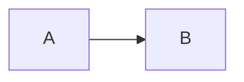

# Image Generation Fix - Debugging & Solutions

## Issues Fixed

### 1. ✅ Chapter Information in Telegram
**Status:** Already working!
- Chapter is already included in the initial Telegram message (line 94-96 in `kobo_ai_companion.py`)
- Format: `📖 *Book Title* (Chapter Name)`
- Passed correctly from API endpoint

### 2. ✅ Image Generation Not Working

**Problem:** Mermaid code was appearing as text in Telegram instead of rendered PNG images.

**Root Causes Identified:**
1. **Insufficient Logging:** No visibility into where the process was failing
2. **Mermaid Code Extraction:** Gemini might return code in various formats
3. **Base64 Encoding Issue:** Used regular b64encode instead of URL-safe encoding
4. **No Error Details:** HTTP errors were logged but not response bodies

---

## Fixes Applied

### 1. Enhanced Logging

Added comprehensive logging throughout the image generation pipeline:

```python
# Track if image generation is enabled
logger.info(f"🎨 Image generation enabled. Model: {self.image_model}")

# Track which approach is being used
logger.info("Using Mermaid diagram approach (text model → mermaid.ink)")

# Show generated Mermaid code
logger.info(f"✅ Generated Mermaid code ({len(mermaid_code)} chars):")
logger.info(f"Mermaid code preview: {mermaid_code[:200]}...")

# Track mermaid.ink request
logger.info(f"Requesting image from mermaid.ink: {mermaid_url[:100]}...")

# Show HTTP response details
logger.warning(f"Failed to render Mermaid diagram: HTTP {resp.status}")
logger.warning(f"Response body: {error_text[:200]}")
```

### 2. Improved Mermaid Code Extraction

Now handles multiple formats Gemini might return:

```python
# Format 1: Markdown with language identifier


# Format 2: Plain code block
```
graph LR
    A --> B
```

# Format 3: Raw Mermaid code (no markdown)
graph LR
    A --> B
```

**Extraction Logic:**
1. Try extracting from ````mermaid` block
2. Try extracting from plain ``` block (with keyword validation)
3. Try using raw text if it starts with Mermaid keywords

**Supported Diagram Types:**
- `graph` - Flowcharts
- `flowchart` - Flowcharts (newer syntax)
- `sequenceDiagram` - Sequence diagrams
- `classDiagram` - Class diagrams
- `stateDiagram` - State diagrams
- `erDiagram` - Entity-relationship diagrams

### 3. Fixed Base64 Encoding

**Issue:** mermaid.ink expects URL-safe base64 encoding

**Before:**
```python
encoded_mermaid = base64.b64encode(mermaid_code.encode('utf-8')).decode('utf-8')
mermaid_url = f"https://mermaid.ink/img/{encoded_mermaid}"
```

**After:**
```python
# Use URL-safe base64 (replace + with -, / with _)
encoded_mermaid = base64.urlsafe_b64encode(mermaid_code.encode('utf-8')).decode('utf-8')
# Remove padding (= characters)
encoded_mermaid = encoded_mermaid.rstrip('=')
mermaid_url = f"https://mermaid.ink/img/{encoded_mermaid}"
```

### 4. Better Error Handling

```python
try:
    async with aiohttp.ClientSession() as session:
        async with session.get(mermaid_url, timeout=aiohttp.ClientTimeout(total=15)) as resp:
            if resp.status == 200:
                image_bytes = await resp.read()
                logger.info(f"✅ Successfully rendered Mermaid diagram to PNG ({len(image_bytes)} bytes)")
                return image_bytes
            else:
                error_text = await resp.text()
                logger.warning(f"Failed to render Mermaid diagram: HTTP {resp.status}")
                logger.warning(f"Response body: {error_text[:200]}")
                return None
except aiohttp.ClientError as e:
    logger.error(f"Network error fetching Mermaid image: {e}", exc_info=True)
    return None
```

---

## How to Debug

### 1. Check Application Logs

Deploy the backend and watch the logs:

```bash
# If running locally
uvicorn main:app --reload

# On Render, check the logs in dashboard
```

**Look for these log messages:**

✅ **Image generation is enabled:**
```
🎨 Image generation enabled. Model: gemini-3-flash-preview
Using Mermaid diagram approach (text model → mermaid.ink)
```

✅ **Mermaid code generated:**
```
✅ Generated Mermaid code (347 chars):
Mermaid code preview: graph LR
    A[Service 1] --> B[Load Balancer]
    C[Service 2] --> B...
```

✅ **Image rendered successfully:**
```
Requesting image from mermaid.ink: https://mermaid.ink/img/Z3JhcGggTFI...
✅ Successfully rendered Mermaid diagram to PNG (45231 bytes)
✅ Sent diagram for 'System Design Interview'
```

❌ **Common Error Patterns:**

```
# Image generation disabled
Image generation disabled (GEMINI_IMAGE_MODEL not set)

# Gemini decided to skip
Gemini decided this concept doesn't need a diagram

# No Mermaid code found
No valid Mermaid code found in response. Full response: ...

# HTTP error from mermaid.ink
Failed to render Mermaid diagram: HTTP 400
Response body: Invalid Mermaid syntax...

# Network error
Network error fetching Mermaid image: Cannot connect to host...
```

### 2. Verify Configuration

Check your `.env` file:

```bash
# Image generation should be enabled
GEMINI_IMAGE_MODEL=gemini-3-flash-preview

# Or use direct image generation (experimental)
# GEMINI_IMAGE_MODEL=gemini-2.5-flash-image

# Or disable
# GEMINI_IMAGE_MODEL=
```

### 3. Test Manually

You can test the Mermaid rendering manually:

1. Get Mermaid code from Gemini
2. Encode it:
```python
import base64
code = """graph LR
    A[Service 1] --> B[Load Balancer]
    C[Service 2] --> B
"""
encoded = base64.urlsafe_b64encode(code.encode('utf-8')).decode('utf-8').rstrip('=')
print(f"https://mermaid.ink/img/{encoded}")
```
3. Open the URL in a browser - should show a PNG diagram

### 4. Check Telegram

**Expected behavior:**
1. User highlights text on Kobo
2. First message: Book title, author, chapter, highlighted text
3. Second message: AI analysis (text)
4. **Third message: 🎨 Diagram image (PNG)**

If you only see messages 1 and 2, check the logs for why image generation failed.

---

## Testing After Deploy

### Step 1: Deploy Backend
```bash
cd highlights-fetch-service
pip install -r requirements.txt  # Ensure aiohttp is installed
# Deploy to Render or restart local server
```

### Step 2: Test on Kobo
1. Select text about a technical concept (e.g., "load balancers", "microservices", "data structures")
2. Click "Ask KoAI (Explain)"
3. Check Telegram - you should see:
   - Original highlight message
   - AI analysis text
   - **PNG diagram image** (if concept benefits from visualization)

### Step 3: Monitor Logs

Watch for successful image generation:
```
🎨 Image generation enabled. Model: gemini-3-flash-preview
Using Mermaid diagram approach (text model → mermaid.ink)
✅ Generated Mermaid code (234 chars):
Mermaid code preview: flowchart TD...
Requesting image from mermaid.ink: https://mermaid.ink/img/...
✅ Successfully rendered Mermaid diagram to PNG (32145 bytes)
✅ Sent diagram for 'System Design Interview'
```

---

## When Images Won't Generate (By Design)

Gemini may decide NOT to generate a diagram if:
- ✅ **Correct:** The concept is abstract or theoretical (e.g., philosophical quotes)
- ✅ **Correct:** The text is a simple definition without visual components
- ✅ **Correct:** The highlighted text is too short or vague

This is intentional! Not every concept benefits from a diagram.

---

## Troubleshooting Guide

### Issue: No logs about image generation at all

**Solution:**
```bash
# Check if GEMINI_IMAGE_MODEL is set
echo $GEMINI_IMAGE_MODEL

# Should output something like: gemini-3-flash-preview
# If empty, image generation is disabled
```

### Issue: "Gemini decided this concept doesn't need a diagram"

**This is normal!** Gemini is being smart about when diagrams add value.

**To test with a concept that WILL generate a diagram, try:**
- "A load balancer distributes traffic across multiple servers"
- "The producer-consumer pattern uses a queue between services"
- "Binary search tree nodes have left and right children"

### Issue: "No valid Mermaid code found in response"

**Solution:** Check the full Gemini response in logs. Gemini might be:
- Returning text explanation instead of code
- Using an unsupported diagram type
- Wrapping code in an unexpected format

The improved extraction logic should handle most cases now.

### Issue: "Failed to render Mermaid diagram: HTTP 400"

**Solution:** The Mermaid syntax is invalid. Check the Mermaid code in logs.

**Common issues:**
- Syntax errors in the generated code
- Special characters not properly escaped
- Unsupported Mermaid features

### Issue: "Network error fetching Mermaid image"

**Solution:**
- Check if mermaid.ink is accessible: `curl https://mermaid.ink/`
- Verify Render can make external HTTP requests
- Check if firewall/security groups are blocking

---

## Performance Notes

### Timing Breakdown:
1. **Text Analysis:** 2-3 seconds (parallel with Kobo response)
2. **Mermaid Generation:** 1-2 seconds (Gemini call)
3. **Image Rendering:** 1-2 seconds (mermaid.ink)
4. **Total for diagram:** ~3-5 seconds

The image generation happens in the background, so it doesn't delay the Kobo response!

---

## Alternative: Direct Image Generation

If you want to try Gemini 2.5 Flash Image for direct generation:

```bash
# In .env
GEMINI_IMAGE_MODEL=gemini-2.5-flash-image
```

**Pros:**
- One-step process (no mermaid.ink)
- Can generate artistic/photorealistic images

**Cons:**
- May generate artistic images instead of clean diagrams
- Less predictable for technical concepts
- Newer model, less tested

**Recommendation:** Stick with Mermaid approach for technical books!

---

## Summary

✅ **Fixed Issues:**
1. Added comprehensive logging throughout image pipeline
2. Improved Mermaid code extraction (handles multiple formats)
3. Fixed base64 encoding (URL-safe with padding removed)
4. Better error handling with detailed HTTP responses

✅ **What You Should See Now:**
- Detailed logs showing image generation flow
- PNG diagrams in Telegram for technical concepts
- Clear error messages if something fails

🚀 **Deploy and test!** The logs will now show you exactly what's happening at each step.


